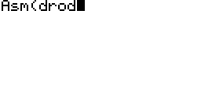
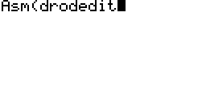
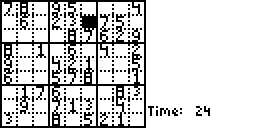
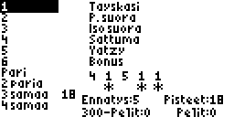
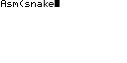
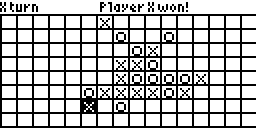
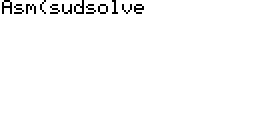
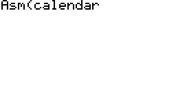
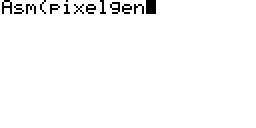

# TI-86 assembly programs

This is a collection of TI-86 assembly programs that I wrote in 2006-2008.

## Background

In 2006, I received a TI-86 graphing calculator for high school. My big brother had the same calculator model, and I had seen earlier that it was possible to run games on it.

Soon after I got my own TI-86, I started researching on how to make my own games. At first I fiddled with TI-BASIC, but quite soon I understood that all the serious games had to be written in Z80 assembly to take full advantage of the hardware.

Back then, I published a couple of my programs in [ticalc.org](https://www.ticalc.org/archives/files/authors/98/9805.html).

Since then, I've only made minimal modifications to them so that they can be assembled with [SPASM-ng](https://github.com/alberthdev/spasm-ng). Originally, I used Assembly Studio 86 which is not available on Linux.

## Games

#### DROD

Clone of the [DROD](https://github.com/CaravelGames/drod) PC game. Includes a level editor and game recording feature.

|  |  | 
|:--:|:--:|
| *Gameplay* | *Level editor* |

#### Sudoku

Sudoku with 3 skill levels and 9x9 board size.

#### Yatzy

[Yatzy](https://en.wikipedia.org/wiki/Yatzy) with a Finnish user interface.

#### Tunnel Snake

Navigate the snake through a tunnel. As you proceed, the levels get increasingly harder.

#### Noughts and crosses

The winner is the player who gets five noughts or crosses in a row. This is a two-player game, so no computer opponent is available.

#### Speed

A reaction game with four buttons that you need to keep pressing in the correct order. Idea from [*Nopeustesti*](https://fi.wikipedia.org/wiki/Nopeustesti).

#### Journey

This game is similar to *Tunnel Snake* but seems unfinished. For example, there's no high scores, the game scrolls infinitely and the difficulty does not increase. This might have been just a prototype of *Tunnel Snake*.

## Other programs

#### Sudoku solver

Attempts to solve the given Sudoku board. Supports loading board directly from the *Sudoku* game.

#### Bignum calculator

Add, subtract, multiply, divide or square large integers.

#### Calendar

Displays calendar for the given month and year.

#### ASM to hex -converter

Converts a TI-86 assembly program to an "uncompiled" hex program that can be edited with the built-in TI-BASIC program editor.

#### Pixel generator

Generates pixels on the screen by choosing an adjacent pixel randomly.

